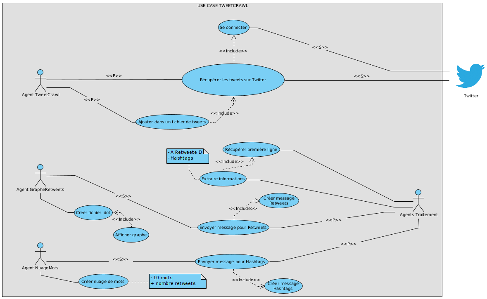

# Projet Multi-Agent - Visualisation de tweets

#### FOUGERON Lisa RAYEZ Laurent ORGERIT Antoine GRÉAU François
___

## Dépendences
Ce projet dépend de l'utilitaire open source de manipulation de graphes GraphViz, et notamment de la commande `dot`.
Il est donc impératif que ce dernier soit installé et que la commande soit connue après des variables d'environnement du système d'exploitation.

## Diagrammes :
- ### Use-case  
- ### Classes  
- ### Collaboration  